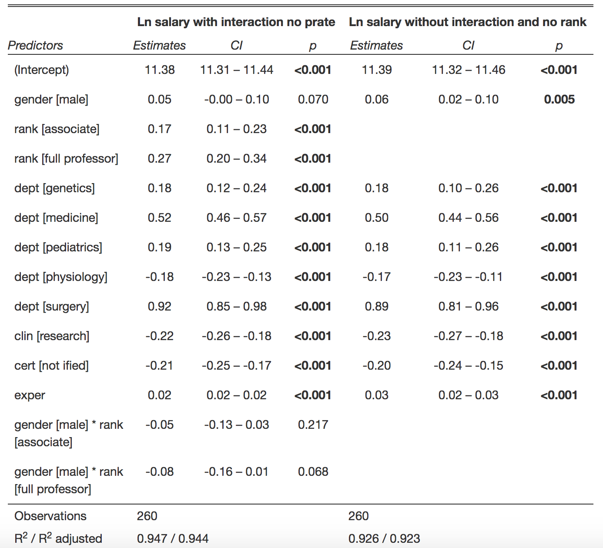
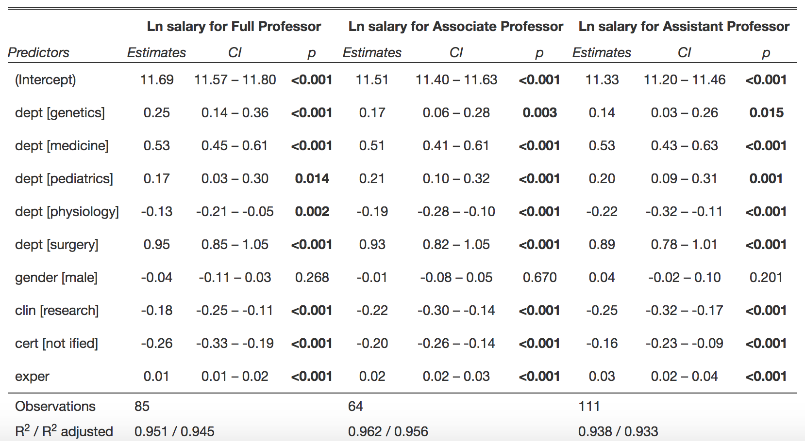

```{r, echo = FALSE, message=FALSE, include=FALSE}

knitr::opts_chunk$set(
  echo = FALSE,
  message = FALSE,
  warning = FALSE, 
  fig.width = 6.5, 
  fig.height = 4.5,
  out.width = "80%")

#loading packages
library(arsenal)
library(tidyverse)
library(corrplot)
library(GGally)


theme_set(theme_minimal())

#reading in data
lawsuit_base = read_csv("./Lawsuit.csv") %>% 
  janitor::clean_names() %>% 
  mutate(sal_avg = (sal94 + sal95)/2)
```

# Abstract

Female faculty from Houston College of Medicine protested unequal salary and positions under Title VI, with data collected from 1995 and 1996. Here, we ask whether they truly faced discrimination based on gender with regards to salary. Firstly, we identified experience, clinical status, department, board certification, and publication rate as significant confounders between gender and log salary, and rank as an effect modifier. For our model, we excluded publication rate due to multicollinearity, and one outlier. We therefore fit linear models predicting log salary by gender, experience, clinical status, department, and board certification, with and without the interaction between rank and gender. While in the presence of rank, gender was not significantly associated with log salary, when rank was excluded, gender did have a significant coefficient. Therefore we conclude that females earn significantly less than men, but this association is due to their positions, promotions, and lack thereof. 

# Introduction

Gender discrimination has long been an issue in the workplace and many cases have arisen based on unequal pay across US history. The Civil Rights Act of 1964, Title VI, created a breakthrough for gender equality in making discrimination with respect to gender unlawful. Yet unfortunately, many women still face unequal treatment at work. The term gender pay gap has been coined to describe discrepancies between the pay of women and their male counterparts. This gap exists across almost all disciplines and fields, yet is most commonly noted with respect to STEM careers (1). For example, in 2001, the American Association for the Advancement of Science (AAAS) identified that women are paid 23% less than their male counterparts in the life sciences (2). Additionally, a study analyzing salary differences between gender of physician researchers from academic institutions in the US by Reshma Jagsi, et al. found that males were paid $13,399 more than females after controlling for possible confounders such as number of publications and academic rank (3). Researchers typically attribute these discrepancies in salary both to individual factors, such as education and experience, and to societal factors such as underrepresentation in politics, women leaving work to have children, and the lack of women in top or managing positions (1).  Although obvious, the impacts of the gender pay gap are profound. In the United States, gender has become the strongest predictors for poverty. Women are at least two times more likely than men to be impoverished (1). 
    
In this paper, we ask whether the gender gap existed among the faculty of Houston College of Medicine in 1994 and 1995, accounting for potential individual level explanations for differences in salary. To answer this question, we use data collected by two female doctors from the college to make their argument for fair treatment in the workplace regarding promotions and salaries.

# Methods

The data was collected as part of the plaintiff’s argument that females were less likely to be appointed full professors and earn less money than men. The data contains `r nrow(lawsuit_base)` rows, each representing a professor. There are `r ncol(lawsuit_base)` variables, giving different characteristics of the professor that may affect their salary. There are variables for their gender (female or male), department (Biochemistry/Molecular Biology, Physiology, Genetics, Pediatrics, Medicine, and Surgery), publication rate, experience (years since obtaining MD), rank (assistant, associate or full professor), and  variables indicating if they have a clinical or research emphasis (clin), and whether they are Board certified (cert). To measure salary, we calculated an average of salary in 1994 and 1995. 
    
Table 1 shows the breakdown of all available variables across gender. Notably, the median salary for males is 163 thousand dollars annually, while for females it is 114 thousand. This relationship is further observed in Figure 1. We also see that males are more likely to be surgeons (23% of males, 5% of females), and females are more likely to work in pediatrics (19% of females, 6% of males). Females are more likely to have a clinical emphasis over research (43% of females, 35% of males), and to be Board certified (34% of females, 24% of males). The average publication rate of females is 5.35, compared to that of males at 4.65. Males have an average of 12 years of experience, while females have an average of 7 years. This relationship is further seen in Figure 2. Lastly, females are much more likely to be assistant professors (65% of females, 28% of males), and males are much more likely to be full professors (15% of females, 45% of males). Given that all other potential explanatory variables of salary appear strongly correlated with gender, we conclude that they should all be considered as potential confounders when investigating the relationship between gender and salary. Previous literature supports these findings, as it has identified productivity, experience, specialty, and degree as confounders in the relationship between gender and salary (4). 

We also assessed the normality of the response variable, salary, as this is an assumption of the linear model. This can be seen on the left in Figure 3. It is clear that salary is strongly right skewed. To correct the abnormality we performed a log transformation of the salary variable, and use this transformed variable in all further analysis. The results of the transformation are on the right of Figure 3. 

To evaluate the relationship between gender and salary, we fit linear models in R. We modified these models to include relevant confounders and account for effect modification. We also tested our models for normality of residuals with Q-Q plots, heteroskedasticity with fitted residual plots, and multicollinearity between predictors through checking the VIFs. Lastly, we checked for outliers in log salary and predictors, and influential points through studentized residuals, hat elements, and Cook’s Distance, respectively. 

# Results

To investigate confounding, we fit models with salary predicted by gender and each additional independent variable, and found that the coefficient on gender changed more than ten percent under the presence of all variables beyond rank. Next, we tested for effect modification by fitting models predicting salary with gender interacted with each other predictor. From these models, only rank had a significant interaction term, and we concluded this interaction should therefore be accounted for in the final model. This decision is backed the research of Yamatani, which identified rank as a significant effect modifier between gender and salary (5).

After fitting a full model including the interaction of rank and gender with all possible variables to predict average salary we first looked for multicollinearity since our exploratory analysis revealed that some explanatory variables had high association with each other. Specifically, the publication rate, prate, had high correlation with other variables and had a variance inflation factor of 16.6. Since a reasonable cutoff for VIFs is 5, we removed publication rate from our model, and found no other multicollinearity issues. 

As the relationship between experience and salary appears linear as seen in Figure 2, and experience is the only included continuous predictor, we chose not to use splines or smoothing functions in our model. Therefore, the model we used to check diagnostics was, $ln(Average salary) \sim gender*rank + dept + clin + cert + exper$. As the diagnostic plots show (Figure 4), the assumptions for residuals seem to be met. The Fitted vs. Residual plot and Scale Location plot show the residuals randomly scattered around 0, suggesting that the residuals have constant variance with respect to predicted log salary values and along the range of our predictors, respectively. Furthermore, apart from one point identified with ID = 184, the residuals satisfy a normal distribution. The Residuals vs Leverage plot shows no concerning leverage points. Lastly, all four diagnostic plots identify the observation 184 and it seems that 184 is a large outlier in our outcome, log salary.(reference diagnostic plots)

Therefore, we next tested for outliers and influential points in our model. We obtained studentized deleted residuals to identify outliers and found one outlier in Y with ID 184 which violates the standard cutoff of 2.5 with a value of 6.78. For leverage points, if we use a cutoff of 0.11, then there are 7 observations among our covariates that fall into the moderate leverage category. If we use 0.5 as the cutoff, then none of the observations have high leverage. Lastly, we used Cook’s distance to identify influential points. Since all Cook’s distances were smaller than 0.5, no influential points were found.

Although through formal tests of influence points, it seems like there are no points that affect our model, we looked further into observation 184 since it seemed like a large outlier in our outcome. Without removing the point, gender is a significant variable in our model with a coefficient of 0.074 and p-value = 0.00738., using a significance level of 0.05. After removing the point from our model, the gender coefficient is 0.0459 with a p-value of 0.0701. This shows that one observation was making it seem like gender had more of an affect on log salary than it actually did. Looking more closely at observation 184, we see that it was a male assistant professor with log salary of 12.48 when the average log salary is about 11.86. Therefore, we decided to remove the outlier in Y with ID 184 from the data for our model to best understand the variables’ relation to salary.

We therefore obtain two models to understand how gender affects salary of professors. The first model includes the interaction term, gender*rank and all other predictors except prate (Table 2). In this model, gender and the interaction term are not statistically significant at a significance level of 0.05, which indicates that gender is not associated with salary when we have accounted for the modification by rank and all confounders. Our model suggests that the salary of a male assistant professor is 1.04 times greater than that of a female assistant professor, controlling for all confounders. Meanwhile, the salary of a male associate professor and male full professor is 0.996 and 0.96 times less than their female counterparts, respectively. As stated, none of these coefficients were significant, holding all confounders constant. 

The next multiple regression model excludes the interaction term and rank (Table 2). In this model, gender is statistically significant at a significance level of 0.05, which indicates there is a difference in average salary between male and female. Here, the salary of male faculty is 1.06 times that of female faculty, accounting for confounders. We include this model to better understand the modification between gender and salary by rank. We can see that gender is a significant predictor of salary, yet this relationship is entirely manifested in the faculty’s position as an assistant, associate, or full professor. Lastly, we stratified our main model into three models predicting salary for assistant professors, associate professors, and full professors (Table 3). In all three of these models the coefficient of gender was not significant, further demonstrating our finding that the association between gender and salary is entirely in relation to an individual’s rank. 

# Conclusion

Our analysis shows that gender is not a significant indicator of salary after accounting for the interaction of rank and gender, and predictors department, clin (clinical or research emphasis ), cert(Board certified), experience (years since obtaining MD). Using an alpha level of 0.05, we found gender was only significant without the presence of rank in our model (model 2), but in our main model (model 1) we find that when rank and the interaction between rank and gender is accounted for, along with all other predictors besides prate, this significance disappears. This implies that while females earn significantly less than men, this association is due to their positions, promotions, and lack thereof. A female who is equally qualified in terms of experience, research, department, and certification is much more likely to be an associate or assistant professor, and therefore to be paid less. However, were females to be placed in the same positions as men, these discrepancies in salary would disappear. Therefore, the female faculty of Houston College of Medicine were correct to object to the discrepancies in position across gender, but not solely to the discrepancies in salary across gender. 

# References: 
1. Reese, Catherine C., and Barbara Warner. “Pay Equity in the States: An Analysis of the Gender–Pay Gap in the Public Sector.” Review of Public Personnel Administration, vol. 32, no. 4, Dec. 2012, pp. 312–331, doi:10.1177/0734371X11428616.

2. Ginther, Donna K. “Is MIT an Exception? Gender Pay Differences in Academic Science.” Bulletin of Science, Technology & Society, vol. 23, no. 1, 2003, pp. 21–26., doi:10.1177/0270467602239767.

3. Jagsi, Reshma, et al. “Gender Differences in the Salaries of Physician Researchers.” Jama, vol. 307, no. 22, 2012, doi:10.1001/jama.2012.6183.

4. Wright, Anne L., et al. “Gender Differences in Academic Advancement.” Academic Medicine, vol. 78, no. 5, 2003, pp. 500–508. 

5. Yamatani, H., and H. Yamatani. "Gender and Salary Inequity: Statistical Interaction Effects." Social Work Research & Abstracts, vol. 18, no. 4, 12/01/1982, pp. 24-27, doi:10.1093/swra/18.4.24.

\pagebreak

# Appendix


### Table 1: Descriptive Statistics

```{r, results="asis"}
#descriptive table
my_labels <- list(dept = "Dept (n%)", gender = "Gender, Male (n%)", clin = "Clin, Clinical Emphasis (n%)", cert = "Certfified, Yes (n%)", prate = "Publication rate", exper = "Experience (years)", rank = "Rank (n%)", sal94 = "Salary 1994", sal95 = "Salary 1995", sal_avg = "Avg Salary") 


my_controls <- tableby.control(
               total = F,
               test=F,  
               digits = 2, 
               digits.pct = 2,
               cat.simplify = T, 
               numeric.stats = c("meansd", "medianq1q3"),
               cat.stats = c("countpct"),
               stats.labels = list(
               meansd = "Mean (±SD)",
               medianq1q3 = "Median (Q1, Q3)",
               countpct = "N (%)"))


data_tabl<- lawsuit_base %>% 
          mutate(gender = factor(gender, labels= c("Female", "Male")), 
                 dept = factor(dept, labels = c("Bio/Molecular Biology", "Physiology", "Genetics", "Pediatrics", "Medicine", "Surgery")), 
                 clin = factor(clin, labels= c("Research emphasis", "Clinical emphasis")),
                 cert = factor(cert, labels= c("Not certified", "Board certified")),
                 rank = factor(rank, labels= c("Assistant", "Associate", "Full professor")))

tab1 <- tableby(gender ~dept + clin + cert + prate + exper + rank + sal94 + sal95 + sal_avg, 
                data=data_tabl, 
                control = my_controls)
summary(tab1, 
        labelTranslations = my_labels, text=T) 
```


```{r}
#cleaning data
lawsuit = read_csv("./Lawsuit.csv") %>% 
  janitor::clean_names() %>% 
  mutate(
    sal_avg = (sal94 + sal95)/2, 
    ln_sal_avg = log(sal_avg), 
    gender = recode(gender, "0" = "female", "1" = "male"),
    clin = recode(clin, "0" = "research", "1" = "clinical"), 
    cert = recode(cert, "0" = "not certified", "1" = "certified"), 
    rank = recode(rank, "1" = "assistant", "2" = "associate", "3" = "full professor"),
    dept = recode(dept, "1" = "biochemistry", "2" = "physiology", "3" = "genetics", "4" = "pediatrics", "5" = "medicine", "6" = "surgery"), 
    
         )
```


### Figure 1: Salary by Gender
```{r}
#######descriptive plots########## 
#salary and gender
lawsuit %>% 
  mutate(gender = recode(gender, "0" = "female", "1" = "male")) %>% 
  ggplot(aes(y = sal_avg, x = gender)) + 
  geom_boxplot() + 
  labs( y = "salary", x = "")
```


### Figure 2: Salary by Experience
```{r}
#salary and experience
lawsuit %>% 
  ggplot(aes(y = sal_avg, x = exper)) + 
  geom_point() + 
  labs(y = "salary", x = "experience (yrs)")
```

### Figure 3: Distribution of Salary and Ln(Salary)
```{r}
#histograms of response var
library(patchwork)
reg_dense = lawsuit %>% 
  ggplot(aes(x = sal_avg)) + 
  geom_histogram(alpha = .6, color = "black") + 
  labs(x = "salary", y = "count", title = "")

ln_dens = lawsuit %>% 
  ggplot(aes(x = ln_sal_avg)) + 
  geom_histogram(alpha = .6, color = "black") + 
  labs(x = "ln(salary)", y = "", title = "")

reg_dense + ln_dens
```


### Figure 4: Correlation Plot
```{r}
#correlation plot 
lawsuit_cor = lawsuit_base %>% 
  select(-id, - sal94, -sal95)
cor(lawsuit_cor) %>%                            
  corrplot(method = "circle", type = "upper", diag=FALSE)
```


```{r}
#data for model 
lawsuit_model = read_csv("./Lawsuit.csv") %>% 
  janitor::clean_names() %>% 
  mutate(
    sal_avg = (sal94 + sal95)/2, 
    ln_sal_avg = log(sal_avg), 
    gender = recode(gender, "0" = "female", "1" = "male"),
    clin = recode(clin, "0" = "research", "1" = "clinical"), 
    cert = recode(cert, "0" = "not certified", "1" = "certified"), 
    rank = recode(rank, "1" = "assistant", "2" = "associate", "3" = "full professor"),
    dept = recode(dept, "1" = "biochemistry", "2" = "physiology", "3" = "genetics", "4" = "pediatrics", "5" = "medicine", "6" = "surgery") ) %>% 
  select(-c(sal94, sal95, sal_avg))

#full model 
full_model = lm(ln_sal_avg ~ gender * rank + . - id, lawsuit_model)
```


### Figure 5: Diagnostic Plots
```{r}
#no prate model 
full_model_no_prate = lm(ln_sal_avg ~ gender * rank + . - prate- id, lawsuit_model)


#model diagnostics

par(mfrow=c(2,2))
plot(full_model_no_prate)


```


```{r}
#remove point 184
lawsuit_model_new = lawsuit_model %>% 
  filter(id != 184)
```

```{r}
#new full model without point 
full_model_no_prate_inter = lm(ln_sal_avg ~ gender * rank + . - prate- id, lawsuit_model_new)

```

```{r}
# full model minus rank
full_model_no_inter = lm(ln_sal_avg ~  . - prate- id - rank, lawsuit_model_new)

```

### Table 2: Main Models



### Table 3: Stratified Models





